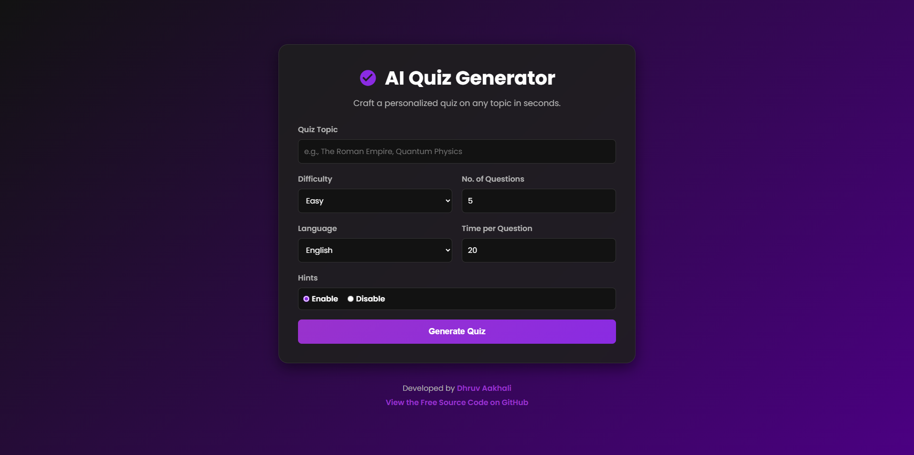
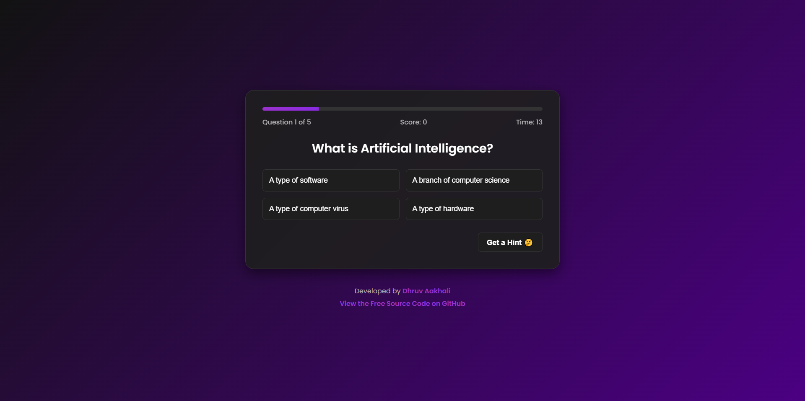

# ✨ AI Interactive Quiz Generator 

[](https://github.com/aakhalidhruv28/Interactive-Quiz-App)
[](https://opensource.org/licenses/MIT)
[](https://github.com/aakhalidhruv28/Interactive-Quiz-App)

An advanced, real-time quiz application that uses the power of Large Language Models (LLMs) through the OpenRouter API to generate unique quizzes on **any topic imaginable**. Built with pure HTML, CSS, and JavaScript, this project offers a sleek, modern, and fully responsive user experience.

---

### 🚀 [**View the Live Demo**](https://ai-interactive-quiz-generator.netlify.app/)

---

## 📚 Table of Contents

- [📸 Screenshots](#-screenshots)
- [✅ Core Features](#-core-features)
- [🛠️ Technologies Used](#️-technologies-used)
- [🏁 Getting Started](#-getting-started)
  - [Prerequisites](#prerequisites)
  - [Installation](#installation)
- [🔑 How to Get and Use an OpenRouter API Key](#-how-to-get-and-use-an-openrouter-api-key)
- [🕹️ How to Use the App](#️-how-to-use-the-app)
- [📜 License](#-license)

---


## 📸 Screenshots

<p align="center">
  
  &nbsp;
  
</p>

---

## ✅ Core Features

*   **🧠 Dynamic AI Quiz Generation**: Leverages the Llama 3 model via OpenRouter to create fresh, relevant questions on any user-provided topic.
*   **⚙️ Full Customization**: Users can tailor their quiz experience by setting:
    *   Any **Topic** they can think of.
    *   **Number of Questions** (3-15).
    *   **Difficulty Level** (Easy, Medium, Hard, Impossible).
    *   **Language** (English, Hindi, Gujarati).
    *   **Timer Duration** per question.
*   **💡 Hint System**: Provides a hint by removing one incorrect answer, adding a strategic element to the quiz.
*   **📊 Real-Time Feedback**:
    *   Live progress bar.
    *   Instant scoring.
    *   Timer countdown for each question.
*   **🏆 Final Score & Feedback**: Displays a detailed score summary with a percentage and personalized motivational feedback.
*   **🎨 Professional UI/UX**: A sleek, modern dark-mode interface that is fully responsive and looks great on all devices.
*   **🚫 Graceful Error Handling**: Displays user-friendly error messages if the AI fails to generate a quiz.
*   **Vanilla Stack**: Built with 100% HTML, CSS, and JavaScript. No frameworks, no libraries.

---

## 🛠️ Technologies Used

*   **HTML5**: For the core structure and content.
*   **CSS3**: For all styling, responsiveness, and animations.
*   **JavaScript (ES6+)**: For the application logic, DOM manipulation, and API integration.
*   **[OpenRouter API](https://openrouter.ai/)**: As the AI backend to generate quiz content in real-time.

---

## 🏁 Getting Started

To get a local copy up and running, follow these simple steps.

### Prerequisites

You only need a modern web browser and a code editor (like VS Code).

### Installation

1.  **Clone the repository:**
    ```bash
    git clone https://github.com/aakhalidhruv28/Interactive-Quiz-App.git
    ```

2.  **Navigate to the project directory:**
    ```bash
    cd Interactive-Quiz-App
    ```

3.  **Get your OpenRouter API Key:**
    Follow the steps in the section below to obtain your free or paid API key.

4.  **Add the API Key to the project:**
    *   Open the `script.js` file.
    *   Find the line: `const OPENROUTER_API_KEY = "YOUR API KEY HERE";`
    *   Replace the existing key with your own.

    > 🚨 **Security Warning:** Do not commit your personal API key to a public repository. The key in this project is for demonstration. For a real-world application, this key should be managed on a secure backend server.

5.  **Run the application:**
    Simply open the `index.html` file in your web browser.

---

## 🔑 How to Get and Use an OpenRouter API Key

OpenRouter allows you to access various AI models, including some with free, rate-limited tiers.

1.  **Sign Up**: Go to [**OpenRouter.ai**](https://openrouter.ai/) and create a new account. You can sign up easily with a Google or email account.
2.  **Fund Your Account (Optional but Recommended)**: Some models (including the most powerful ones) are paid. You can add credits to your account (as little as $1) to get started. Many free models are also available but may be slower or less powerful.
3.  **Get Your API Key**:
    *   Click on your profile icon in the top right.
    *   Go to **Keys**.
    *   Click **"+ Create Key"**.
    *   Give your key a name (e.g., "QuizApp") and click "Create".
4.  **Copy Your Key**: Your new API key will be displayed. Copy it immediately.
5.  **Implement the Key**: Paste the copied key into the `script.js` file as described in the "Installation" steps above.

---

## 🕹️ How to Use the App

1.  **Enter a Topic**: Type any subject you want to be quizzed on.
2.  **Customize Filters**: Adjust the difficulty, number of questions, language, and timer settings to your liking.
3.  **Generate Quiz**: Click the "Generate Quiz" button and wait a few moments for the AI to create your personalized quiz.
4.  **Answer Questions**: Read each question and select the answer you think is correct before the timer runs out.
5.  **Use Hints**: If you're stuck, use the hint button to remove one wrong option.
6.  **View Score**: After the last question, your final score and performance feedback will be displayed.
7.  **Play Again**: Click "Create Another Quiz" to start over with new topics and settings!

---

## 📜 License

This project is distributed under the MIT License. See the `LICENSE` file for more information.

```
MIT License

Copyright (c) 2025 Dhruv Aakhali

Permission is hereby granted, free of charge, to any person obtaining a copy
of this software and associated documentation files (the "Software"), to deal
in the Software without restriction, including without limitation the rights
to use, copy, modify, merge, publish, distribute, sublicense, and/or sell
copies of the Software, and to permit persons to whom the Software is
furnished to do so, subject to the following conditions:

The above copyright notice and this permission notice shall be included in all
copies or substantial portions of the Software.

THE SOFTWARE IS PROVIDED "AS IS", WITHOUT WARRANTY OF ANY KIND, EXPRESS OR
IMPLIED, INCLUDING BUT NOT LIMITED TO THE WARRANTIES OF MERCHANTABILITY,
FITNESS FOR A PARTICULAR PURPOSE AND NONINFRINGEMENT. IN NO EVENT SHALL THE
AUTHORS OR COPYRIGHT HOLDERS BE LIABLE FOR ANY CLAIM, DAMAGES OR OTHER
LIABILITY, WHETHER IN AN ACTION OF CONTRACT, TORT OR OTHERWISE, ARISING FROM,
OUT OF OR IN CONNECTION WITH THE SOFTWARE OR THE USE OR OTHER DEALINGS IN THE
SOFTWARE.
```

---

<p align="center">
  Developed by <strong>Dhruv Aakhali</strong>
</p>
